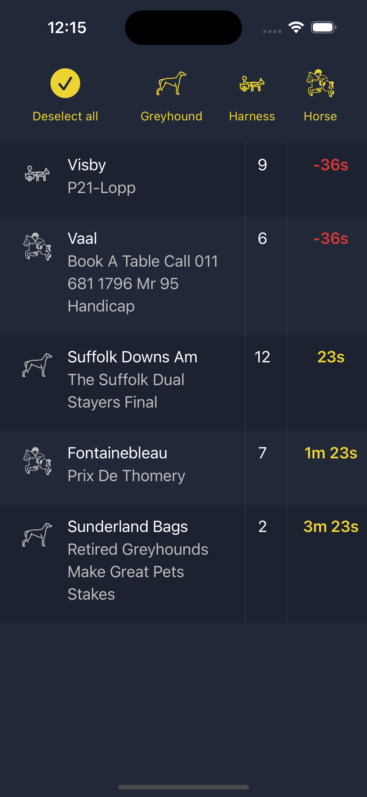
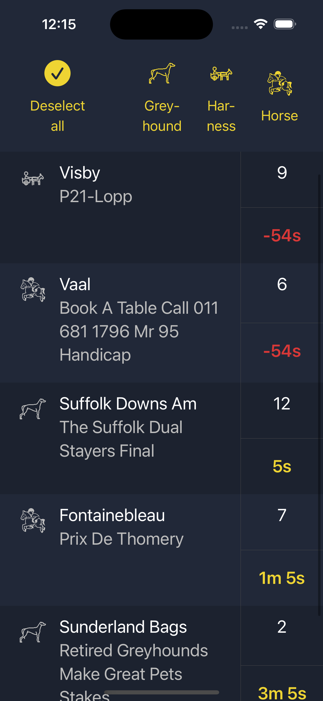

#  Entain Sport

This project is the showcase of MVVM and SwiftUI implementation

## Requirements

- Request API:  https://www.neds.com.au/next-to-go 
- Use custom decodable to decode the response
- Show meeting name, race number and advertised start as a count down for each race
- Only see 5 races nearest. If one minute passed the start time of the race, that race should be hidden from display
- Able to filter races by Horse, Harness or Greyhound
- If user don't filter (deselect all options above), we show next 5 races.
- Data will refresh to get new response from API if the list is less than 5 races
- Add accessibility support and dynamic type support

## Environment
- XCode 15.0
- iOS 17

## How to run
Code can be downloaded and run on XCode 15, there is no usage of Swift Package Manager.

## Explanation

- I use MVVM architecture, following SOLID principals.
- Project file structure contains 2 folders: UI and Data

## Data
**Repository** and **APIRepository** are 2 classes to handle API calls and decode the API response. When calling API, the process is running asynchronous.

When API response and decoding process are completed, we send the **Result** to the caller (ViewModel)

We also have **DataHelper** to populate random data to show on Preview

## UI
The **RacesViewModel** will receive data response from **APIRepository** and reformat to **RaceItemViewModel** to show on view. This class is declared as ObservableObject so **RacesView** can subscribe to the changes in filter buttons (**selectedGreyhound**) or view models to display and filter the showing list

For count down timer, we only declare one timer in **RacesViewModel** and use this timer to update the displayed value, with the help from **TimeHelper**

If the showing list has less than 5 items, we trigger the API refresh to fetch more items. This approach has 1 drawback that the API can return races for one category. So to satisfy the requirements of seeing 5 races of any category, we think the API should return the races based on the category request.

## Testing (coverage: over 90%)
Project includes some of test case
- Test for **TimeHelper**, where it will format the TimeInterval from API response to minutes and seconds
- Test for **RacesViewModel**, where we will need **MockRepository** to populate random data for testing
- Test for **Repository** to test whether API returns valid or invalid data
